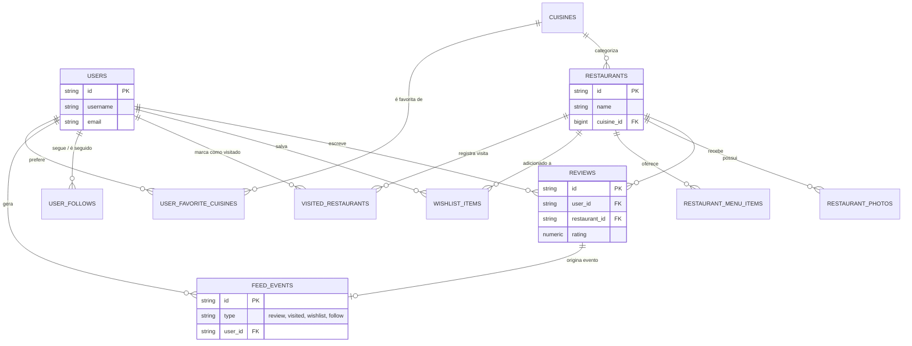
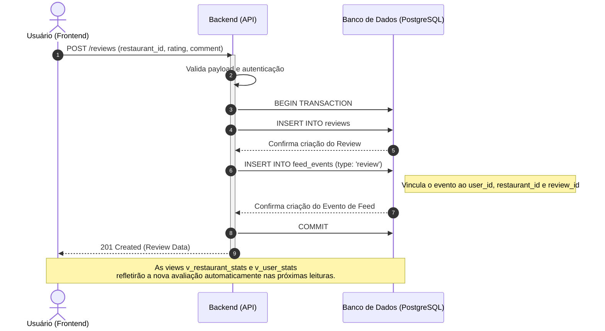

Repositório dedicado para o sistema Garfada, desenvolvido para o trabalho prático da disciplina de Engenharia de Software UFMG.

O Garfada é uma plataforma de catálogo e avaliação de restaurantes projetada para centralizar e socializar a experiência gastronômica. Inspirado em grandes sistemas de avaliação de filmes (IMDb, Rotten Tomatoes, Letterboxd etc), o sistema permite que usuários registrem suas visitas, críticas, atribuam notas e organizem listas de desejos personalizadas. Através de filtros dinâmicos e perfis sociais, a aplicação conecta o paladar da comunidade com detalhes reais do cardápio, preços e ambientes.

## Membros
- Daniel da Cunha Costa - Full Stack
- Isaac Reyes Alves de Abreu - Full Stack
- Pedro Luiz Silva - Full Stack

## Tecnologias e Agentes
- React + Node.js + PostgreSQL 
- Codex

## Testes

Backend unitario:

```bash
cd backend
npm run test:unit
npm run test:coverage
```

Frontend unitario:

```bash
cd frontend
npm test
npm run test:coverage
```

End-to-end com Playwright:

```bash
cd frontend
npm run test:e2e
```

Os testes E2E sobem uma stack Docker isolada definida em
`docker-compose.e2e.yml`, com frontend em `http://127.0.0.1:5174`, backend em
`http://127.0.0.1:3002`, banco `garfada_e2e` e runner Playwright em container.
Para execução local interativa, use `npm run test:e2e:install` antes de
`test:e2e:ui` ou `test:e2e:headed`; se o Chromium local reclamar de biblioteca
ausente, rode `sudo npx playwright install-deps chromium`. Nesses modos
interativos, o frontend aponta para `http://127.0.0.1:3002`, para que login e
cadastro funcionem no navegador do host. Para detalhes de cobertura e depuração,
consulte `docs/e2e-tests-report.md`.

Integracao backend com PostgreSQL:

```bash
cd backend
npm run test:integration
```

A cobertura minima configurada para backend e frontend e de 70% em statements,
branches, functions e lines. Para detalhes de execucao via Docker e variaveis
`TEST_PG*`, consulte `docs/integration-tests.md`.

## Histórias de usuários
- Como usuário do sistema, gostaria de filtrar os restaurantes por tipo de cozinha, faixa de preço, para que eu encontre rapidamente um lugar que combine com meu desejo e condição no momento.
- Como cliente, eu quero poder visualizar as fotos dos ambientes e o cardápio do restaurante, para avaliar se o local é adequado para ocasião.
- Como usuário, eu gostaria de dar uma nota de 1 a 5 estrelas e escrever um comentário descrevendo minha visita ao local, para que eu possa expressar minha opnião e ajudar a comunidade a escolher melhor, e também conseguir ver a opnião de outras pessoas.
- Como usuário, eu quero poder salvar restaurantes em um "Lista de Desejos", para poder organizar melhor como um lembrete onde eu planejo visitar futuramente.
- Como usuário, eu quero poder marcar restaurantes como "Visitados", para que eu mantenha um registro pessoal da minha trajetória gastronômica bem como acompanhar a trajetória das minhas conexões.
- Como usuário, eu quero poder seguir amigos ou críticos locais, que também utilizam o sistema, para poder acompanhar as avaliações de pessoas em cujo paladar eu confio.
- Como usuário cadastrado, eu quero poder editar minha bio e foto de perfil para que as outras pessoas na rede possam me identificar e conhecer meu estilo de culinária favorito.
- Como usuário gostaria de ver as médias estatísticas (avaliações, comentários, visitas) dos restaurantes no catálogo para poder auxiliar na minha escolha.


## Diagramas UML

### Diagrama de Entidade-Relacionamento (ERD)



### Diagrama de Sequência (Fluxo de Interação e Propagação no Feed)


